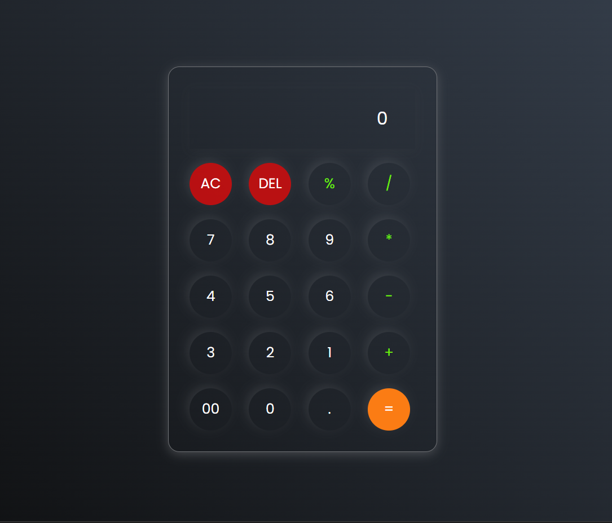

# Simple Calculator

[Live Demo ](https://pureshwargonekar.github.io/Simple_Calculator/)

In this web-based calculator, I have utilized HTML, CSS, and JavaScript to create a user-friendly tool for performing basic mathematical operations. Whether you need to add, subtract, multiply, or divide numbers, this calculator is designed to provide quick and accurate results.

## Key Features:

1. **User-Friendly Interface:** The calculator features a clean and intuitive interface that resembles a traditional handheld calculator. The layout includes a display screen to show the input and output, along with a set of buttons for numerical digits and various mathematical operations.

2. **Basic Arithmetic Operations:** Perform simple mathematical calculations with ease. The calculator supports addition, subtraction, multiplication, and division, allowing you to compute basic equations quickly. The buttons for these operations are clearly labeled and easily accessible.

3. **Numeric Input:** Input numbers effortlessly using the provided numerical buttons. These buttons include digits from 0 to 9, allowing you to input any combination of numbers required for your calculations. The input can be given by both the ways i.e. via mouse click and keyboard.

4. **Clear Functionality:** Correct any mistakes or reset the calculator by utilizing the clear button. This button clears the input and output, allowing you to start fresh with a new calculation.

5. **Calculation Execution:** Trigger the calculation by using the equals (=) button. Once pressed, the calculator evaluates the input and provides the result on the display screen. The result is updated in real-time, allowing you to see the outcome of your calculations immediately.

6. **Responsive Design:** The calculator is designed to be responsive, adapting to various screen sizes and devices. Whether you access it from a desktop computer, tablet, or mobile phone, the calculator interface adjusts accordingly, ensuring a seamless user experience.

## Screenshot

 
 

***Experience the simplicity and convenience of My Simple Calculator. Perform basic mathematical operations effortlessly and obtain accurate results in an instant. This tool is perfect for quick calculations on the go or whenever you need a handy digital calculator at your fingertips.***

